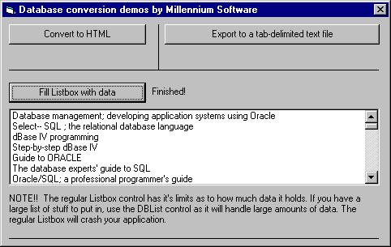



## DB Conversion Techniques

### Description

This code is an update of my previous submission. I put in code to convert database info to a comma delimited file, and to fill a listbox with data. I'm still working on it to do more things (SQL searches, etc.), and I'm going to do images,and things like that. I'm also going to improve the conversion to HTML to make it even better. Have fun with it!
 
### More Info
 
You MUST make a reference to Microsoft DAO 3.0 Library in order to make these codes work right.

             |
---                |---
**Submitted On**   |2000-04-22 02:19:22
**By**             |[Syllva Tech Software](https://github.com/Planet-Source-Code/PSCIndex/blob/master/ByAuthor/syllva-tech-software.md)
**Level**          |Beginner
**User Rating**    |5.0 (10 globes from 2 users)
**Compatibility**  |VB 4\.0 \(32\-bit\), VB 5\.0, VB 6\.0
**Category**       |[Databases/ Data Access/ DAO/ ADO](https://github.com/Planet-Source-Code/PSCIndex/blob/master/ByCategory/databases-data-access-dao-ado__1-6.md)
**World**          |[Visual Basic](https://github.com/Planet-Source-Code/PSCIndex/blob/master/ByWorld/visual-basic.md)
**Archive File**   |[CODE\_UPLOAD50624222000\.zip](https://github.com/Planet-Source-Code/syllva-tech-software-db-conversion-techniques__1-7479/archive/master.zip)

